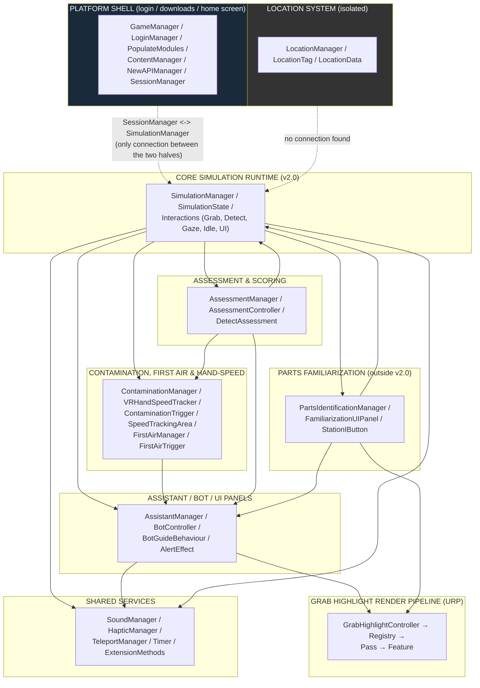
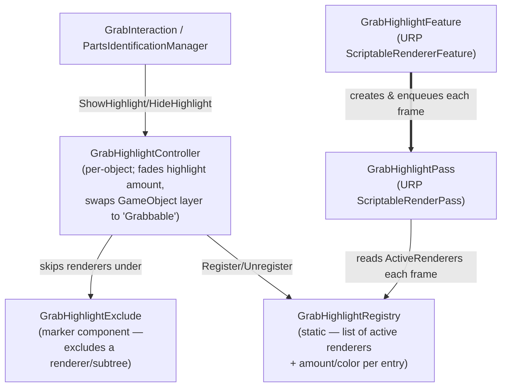
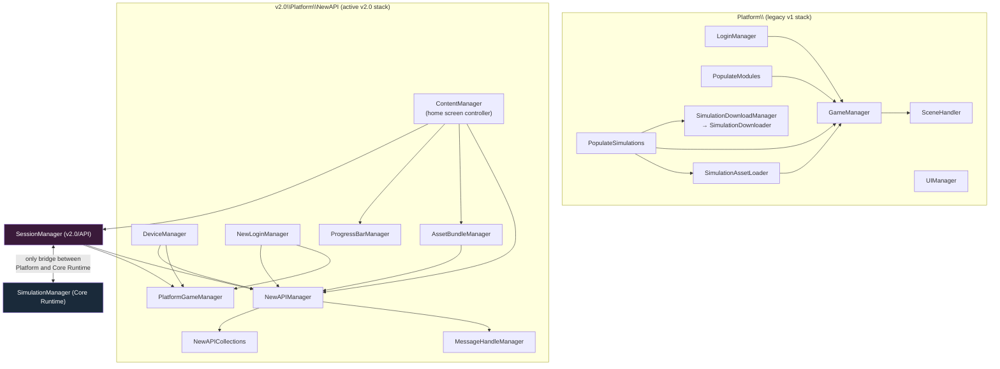
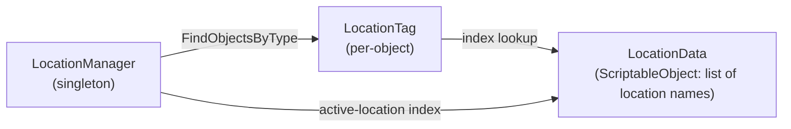

# Simulation System — Architecture Diagram
### Version 2.1.17 — covers all 144 C# scripts under `Assets/Simulation System`

---

## 1. How to read this

- **Solid arrow** `A --> B`: A directly calls a method on / reads a field of B.
- **Dashed arrow** `A -.-> B`: A subscribes to a static event/action fired by B (or vice versa — direction shown is "listener depends on source").
- **Thick arrow** `A ==> B`: A owns/instantiates/drives B as a sub-component.
- Diagrams are grouped by subsystem because a single 138-node graph is unreadable. Section 12 is the flat per-script reference covering every file, including the small leaf utilities that don't earn a diagram node.
- `*.Instance` singletons are written as plain `ClassName` in diagrams — assume singleton access unless noted otherwise.

---

## 2. Top-level module map



**Key fact about the whole codebase**: the Platform shell (login, module/simulation browsing, downloads, home screen) and the Core Simulation Runtime (the actual VR training experience) are two almost entirely separate programs sharing one Unity project. The **only** bridge between them is `SessionManager` (Platform side, singleton) talking to `SimulationManager` (Core side, singleton) — see §8. The Location system is completely disconnected from everything (§9). `v2.0/API/APIManager.cs` + `APICollections.cs` are dead code, fully superseded by the `NewAPI` folder.

---

## 3. Core Runtime — Simulation flow (SimulationManager → SimulationState → Interactions)

```mermaid
flowchart TD
    SM["SimulationManager\n(singleton)"]
    SS["SimulationState\n(one per step)"]
    INT["Interactions (abstract base)\ncanInteract property, InteractionTimer,\nOnCanInteractChanged hook"]
    GI["GrabInteraction"]
    DI["DetectInteraction"]
    GZ["GazeInteraction"]
    ID["IdleInteraction"]
    UI["UIInteraction"]
    TIMER["Timer\n(coroutine-based wait loop)"]
    AM["AssistantManager"]
    ASM["AssessmentManager"]
    TP["TeleportManager"]
    SESS["SessionManager"]
    PIM["PartsIdentificationManager\n(Simulation Familiarization)"]
    SND["SoundManager"]

    SM ==>|owns states list| SS
    SM -->|MoveToState / NotifyStateComplete| SS
    SS -->|StartInteraction/StopInteraction/\nResetInteraction/HasInteractionEnded| INT
    INT --> GI
    INT --> DI
    INT --> GZ
    INT --> ID
    INT --> UI
    INT ==>|hosts coroutine| TIMER
    SS -->|EvaluateStateInteractions,\nSetProgressFromSimulation| AM
    SS -->|BeginState/OnInteractionStarted/\nOnInteractionCompleted/CloseState| ASM
    SS -.->|TeleportStarted/TeleportCompleted| TP
    SM -->|PauseSimulation/ResumeSimulation\nsets canInteract on every Interactions\nin currentState| INT
    SM -->|BeginSession/CloseSession| ASM
    SM -->|CreateSession/UpdateSession/\nEndSession/GetElapsedTime| SESS
    SESS -->|AssignStepSessionID,\nsetModeUI| SM
    SM -->|TryInterceptStateComplete\n(FreeRoam mode only)| PIM
    PIM -->|MoveToState, reads currentState/states| SM
    SM -->|PlaySimulationStart/End| SND
```

**Notes**
- `SimulationState.RunSequence()` is a coroutine that walks `listOfInteractions` in order, `yield return new WaitUntil(() => interaction.HasInteractionEnded())` between each — this is the actual step-by-step engine.
- `Interactions.canInteract` is a **property**, not a field (fixed this session) — every write to it (from `SimulationManager`, `DetectInteraction`, `AssessmentManager`, `MoveToHelper`, or the interaction's own `StartInteraction`/`StopInteraction`) fires `OnCanInteractChanged`, which `GrabInteraction` overrides to keep its physical grab `Collider` in lockstep automatically.
- `Timer` (fixed this session) now runs its wait loop as a real Unity coroutine on whichever `Interactions`/`CustomButton` instance owns it, instead of `async void` + `Task.Yield()` — this was the root cause of the intermittent stuck-detect bug.

---

## 3a. Step Save-State (Restart Step / Restart Interaction)

```mermaid
flowchart TD
    SM["SimulationManager"]
    SS["SimulationState"]
    INT["Interactions (abstract base)"]
    GI["GrabInteraction"]
    DI["DetectInteraction"]
    SSC["StepStateComponent\n(abstract capture/restore contract)"]
    SOS["SceneObjectSnapshot\ntransform/parent/active-state/Animator"]
    SSH["StepStateHook\nUnityEvent passthrough"]

    SM -->|RestartCurrentState → MoveToState(isRestart: true)| SS
    SM -->|RestartCurrentInteraction| SS
    SS -->|CaptureState/RestoreState\n(once, at true top of step)| INT
    SS -->|extraStepStateHooks list\n(same drag-in pattern as listOfInteractions)| SSC
    SSC --> SOS
    SSC --> SSH
    INT --> GI
    INT --> DI
    DI -->|fans out — detected objects aren't\nin listOfInteractions for Detect-type steps| GI
    SS -->|CaptureStepState right before\neach interaction's own turn, in RunSequence| INT

    style SSC fill:#1a2a3a,color:#fff
```

**Notes**
- Restart previously only reset each `Interactions`' internal flags (`IsStarted`/`IsCompleted`/timer) via `ResetInteraction()` — nothing put moved objects back or told other scripts to undo their progress. Restart now works like a real save-state.
- Two independent baselines reuse the exact same `CaptureStepState()`/`RestoreStepState()` contract, just captured at different times: a **step-level** baseline taken once at the true top of the step (restored by `RestartCurrentState`), and a **per-interaction** baseline re-captured immediately before each interaction's own turn in `RunSequence` (restored by `RestartCurrentInteraction`) — so restarting interaction N never undoes interaction N-1's legitimate completed work.
- `GrabInteraction` snapshots/restores its own transform+parent (reusing the existing `MyTransform` helper). `DetectInteraction` fans out to every detected object's own `GrabInteraction`, since those objects live outside `listOfInteractions` for detect-type steps.
- `SceneObjectSnapshot` is the generic "put this scene object back" component for anything else that isn't a `GrabInteraction` — undoes enable/disable, transform, *and* any `Animator`'s parameters + exact per-layer state/time in one component. `StepStateHook` is the escape hatch: wire any existing script's own methods to its `onCaptureStepState`/`onRestoreStepState` UnityEvents from the Inspector, with zero code changes to that script.
- Pause/Resume needed no changes — all grabbable objects use kinematic, no-gravity `Rigidbody`s with purely transform-driven movement (`InteractionBuilderWindow.AddKinematicRigidbody`), so `canInteract=false` already fully freezes the scene.

---

## 4. Core Runtime — Grab / Detect / Contamination / First Air / Hand-Speed detail

```mermaid
flowchart TD
    GI["GrabInteraction"]
    GPD["GrabPinchDetector\n(one per hand)"]
    GM["GrabManager\n(holds left/right GrabPinchDetector refs)"]
    HPL["HandPoseLock / ControllerPoseLock"]
    RP["RecordedPose / BakedPose\n(IPoseSource)"]
    PGU["ProximityGrabUI"]
    GHC["GrabHighlightController"]
    DI["DetectInteraction"]
    MTH["MoveToHelper"]
    DC["DissolveController"]
    CM["ContaminationManager"]
    CT["ContaminationTrigger\n(per-collider, static event)"]
    STA["SpeedTrackingArea\n(per-collider, static events)"]
    VRT["VRHandSpeedTracker\n(independent left/right tracking)"]
    FAM["FirstAirManager"]
    FAT["FirstAirTrigger\n(per-collider, static event)"]
    AM["AssistantManager"]

    GPD -->|TryGrabFrom, canInteract check\n(defense-in-depth added this session)| GI
    GPD --> HPL
    GM ==>|owns refs to| GPD
    GI --> HPL
    GI --> RP
    GI ==>|owns/drives| PGU
    GI ==>|owns| GHC
    GI -->|onGrabbed/onReleased listeners| MTH

    DI -->|ForceReleaseSuppressReset,\nStopInteraction, ResetObjectAfterDetect,\ncanInteract swap| GI
    DI -->|dissolve path| DC
    DI -->|TeleportObjectToDetect| MTH
    DI -.->|OnTriggerEnter/Exit — race fixed\nby Timer coroutine rewrite| DI

    CT -.->|OnHandContactDetected\nstatic event| CM
    STA -.->|OnHandEnteredArea/ExitedArea\nstatic events| VRT
    VRT -.->|OnSpeedViolationDetected/Resolved\n(per-hand, carries SpeedTrackingArea)| CM
    CM -->|EnableAllSpeedTrackingAreas,\nColliderToZone/AreaToZone lookups\n(fixed: all zones now simultaneous)| STA
    CM -.->|onContaminationTriggered/Resolved,\nonSpeedViolationTriggered/Resolved\n(per-zone uiPanel/handSpeedUIPanel)| AM

    FAT -.->|OnHandContactDetected\nstatic event| FAM
    FAM -.->|onFirstAirTriggered/Resolved\n(per-zone uiPanel)| AM

    style CM fill:#3a1a1a,color:#fff
    style FAM fill:#3a1a1a,color:#fff
    style GI fill:#1a2a3a,color:#fff
```

**Notes**
- `ContaminationManager` was the subject of most of a prior session's fixes: the old "one active zone at a time" model (driven by a `SetActiveZone()` call that was **never invoked anywhere in the project**) has been removed entirely — every zone now monitors its own colliders/speed-area simultaneously and independently, each with its own `uiPanel` / `handSpeedUIPanel`.
- `VRHandSpeedTracker` tracks left/right hands as fully independent state so two different zones can show hand-speed violations at the same time.
- `GrabPinchDetector.TryGrab()` now explicitly skips any `GrabInteraction` whose `canInteract` is false, on top of the collider itself being disabled — belt-and-suspenders against the stuck-highlight/stuck-grab class of bug.
- `FirstAirManager`/`FirstAirTrigger` (new) are a deliberate 1:1 architectural mirror of `ContaminationManager`/`ContaminationTrigger` — same zone/trigger/threshold/UI model, minus the hand-speed sub-system, which isn't conceptually tied to first air. Fully independent of Contamination: any number of Contamination and First Air zones can be triggered at the same time, each with its own panel.

---

## 5. Assistant / Bot / UI panel system

```mermaid
flowchart TD
    AM["AssistantManager\n(singleton, huge panel state machine)"]
    BC["BotController"]
    BGB["BotGuideBehaviour"]
    GPF["GridPathfinder"]
    SND["SoundManager"]
    HAP["HapticManager"]
    CM["ContaminationManager"]
    FAM["FirstAirManager"]
    TP["TeleportManager"]
    SF["ScreenFade"]
    ALE["AlertEffect\n(static AlertStarted/AlertFinished)"]
    PBC["PanelButtonController"]
    CB["CustomButton"]
    UI["UIInteraction"]
    DC["DissolveController"]
    ASM["AssessmentManager"]

    AM ==>|Summon/Dismiss/OnPromptShown/\nShowBotUI/HideBotUI| BC
    BC -.->|GuideFinished static event| BGB
    BGB -->|ComputePathWorld| GPF
    BC -->|PlayBotSummon/Dismiss/HelpCalled/\nPromptShown/UIOpen/UIClose/Discard| SND
    SND -.->|matching haptic on\nnearly every SFX call| HAP
    CM -.->|onContaminationTriggered/Resolved,\nonSpeedViolationTriggered/Resolved| AM
    FAM -.->|onFirstAirTriggered/Resolved| AM
    AM -->|per-zone PopIn/PopOut,\nreference-counted pause/restart\n(fixed this session — was single-panel only)| AM
    AM -.->|TeleportStarted/TeleportCompleted| TP
    TP --> SF
    ALE -.->|AlertStarted/AlertFinished\n(screen vignette)| AM
    AM --> PBC
    AM --> DC
    UI -->|TriggerBotUI / HideBotUI| AM
    UI --> CB
    ASM -->|ShowHintPrompt| AM

    style AM fill:#1a2a3a,color:#fff
```

**Notes**
- This session removed the single shared "Contamination Panel" and the legacy dual-mode hand-speed floating panel (with its slide-to-anchor animation) entirely from `AssistantManager`. Both are now per-zone, tracked via `HashSet<GameObject>` + `Dictionary<GameObject, CancellationTokenSource>` so any number of zone popups can be open concurrently without interrupting the Prompt/Help/BotUI panel state machine.
- Added a "Pre/Post Prompt Panel" (`prePostPromptPanel`/`prePostPromptText`) as a new default slot for pre/post ("clause") prompt text, separate from the main Bot Prompt Panel.
- `PromptInteraction` and `Progress` (both in `Assistant/Assistant Interactions/`) are smaller, more standalone helpers — `PromptInteraction` is explicitly marked legacy/non-state-driven; `Progress` just drives one progress-bar slider+text and is called by `AssistantManager.SetProgressFromSimulation()`.
- `FirstAirManager` (new) is wired into `AssistantManager` identically to `ContaminationManager` — own tracked panel set + CTS map, same pause/restart reference-counting, same TMP atlas warm-up — so First Air panels behave exactly like Contamination panels without any special-casing in `AssistantManager`.

---

## 6. Assessment & scoring system

```mermaid
flowchart TD
    ASM["AssessmentManager\n(singleton, owns all scoring logic\n+ contamination/first-air/fast-hand penalties)"]
    AC["AssessmentController\n(sibling component on each\nSimulationState GameObject — pure config)"]
    SM["SimulationManager"]
    SS["SimulationState"]
    AM["AssistantManager"]
    GI["GrabInteraction"]
    DI["DetectInteraction"]
    INT["Interactions / GazeInteraction /\nIdleInteraction / UIInteraction"]
    CB["CustomButton\n(hint button)"]
    CM["ContaminationManager"]
    FAM["FirstAirManager"]
    DA["DetectAssessment\n(legacy, NOT wired into\nAssessmentManager's live flow)"]

    ASM -->|reads simulationMode,\ncurrentState| SM
    ASM -->|BeginState/OnInteractionStarted/\nOnInteractionCompleted/CloseState\n(called BY SimulationState)| SS
    ASM -->|GetComponent, reads\ninteractionConfigs + checkboxes\n(RecalculateInteractionShares)| AC
    ASM -->|ShowHintPrompt on hint click\nAND on Contamination/First Air trigger| AM
    ASM -->|canInteract swap, resetOnRelease,\nForceUngrab, grabHighlightController| GI
    ASM -->|SetupWrongObjects/ClearWrongObjects,\nOnWOTDEntered, canInteract swap| DI
    ASM -->|SetRadialUIVisible,\nvisual toggling for hints| INT
    ASM --> CB
    CM -.->|onContaminationTriggered,\nonSpeedViolationTriggered (Fast Hand)| ASM
    FAM -.->|onFirstAirTriggered| ASM
    DA -.->|reads simulationMode| SM
    DA -->|ChangeDetectType| DI

    style ASM fill:#1a3a1a,color:#fff
    style DA fill:#333,color:#fff
```

**Updated**: `AssessmentManager` now *is* coupled to `ContaminationManager` and `FirstAirManager` — it subscribes directly to `onContaminationTriggered`/`onSpeedViolationTriggered`/`onFirstAirTriggered` and deducts a centrally-configured penalty from whichever step is currently active, but only when that step's `AssessmentController` has the matching checkbox (`contaminationAssessed`/`firstAirAssessed`/`fastHandAssessed`) on. `DetectAssessment` (`Assessment Types/DetectAssessment.cs`) is still a separate, older per-interaction assessment component not actually driven by `AssessmentManager`'s real runtime path — the live wrong-answer logic lives entirely in `AssessmentController.interactionConfigs` + `AssessmentManager`.

**Compulsory 1-mark-per-step scoring**: every assessed step is worth exactly `AssessmentController.StepCompulsoryMaxScore` (1) total. `AssessmentController.RecalculateInteractionShares()` auto-divides that 1 mark evenly across `interactionConfigs`, floored to 1 decimal, remainder going to the last interaction so the total always sums to exactly 1 (3 interactions → 0.3, 0.3, 0.4) — runs on `OnValidate()` in the Editor and again in `AssessmentManager.BeginState()` as a runtime safety net. `contaminationPenalty`/`firstAirPenalty` default to that same full 1-mark step score (a violation zeroes the step, clamped at the existing floor of 0); `fastHandPenalty` defaults to 0.5. Contamination/First Air triggers on an assessed step also replay the same prompt+highlight reveal `OnHintClicked` uses (`AssistantManager.ShowHintPrompt` + `EnableVisualsForInteraction`) — Fast Hand only deducts silently. Three new `AssessmentController` message fields (`contaminationMessage`/`firstAirMessage`/`hintTakenMessage`) feed `AssessmentManager.GetStepMessage()`, which `SimulationManager.MoveToState` sends to the backend as that step's `error_message` (priority: Contamination > First Air > Hint Taken > the existing `assessmentStepMessage` default).

---

## 7. Grab Highlight render pipeline (URP)



This is a clean one-way pipeline: any `GrabHighlightController` registers its renderers with the static `GrabHighlightRegistry`; the URP feature/pass pair reads that registry every frame to draw the outline overlay. `GrabHighlightOptOut` (added this session, documented in `CHANGELOG.txt`) is a marker script of the same shape as `GrabHighlightExclude`, attached to the grab timer UI object so the timer's own renderer never gets swept into this layer-swap system.

---

## 8. Platform shell — login / downloads / home screen



**Notes**
- `Platform\` (legacy) and `v2.0\Platform\NewAPI\` (current) are two parallel, largely independent implementations of the same "browse modules → pick simulation → download → launch" flow. It's unclear from the code alone which one is actually wired into the shipped scene(s) — both are fully functional and present.
- `v2.0\API\APIManager.cs` + `APICollections.cs` are **dead code**: a near-duplicate of `NewAPIManager`/`NewAPICollections` that nothing in the live project actually calls.
- `SessionManager` is the **only** class that reaches across from the Platform layer into the Core Runtime (`SimulationManager.Instance`), and `SimulationManager` calls back into it for the entire session-logging lifecycle (`CreateSession`, `UpdateSession`, `EndSession`, `GetElapsedTime`, `ResetElapsedTime`). This is the single seam joining the two halves of the project.

---

## 9. Location system (fully isolated)



Project-wide search found **zero references** to `LocationManager`/`LocationTag`/`LocationData` outside `v2.0/Location/`. Nothing in the Core Runtime, Assessment, or Platform layers touches this system.

---

## 10. Singleton inventory (static `Instance` pattern)

| Subsystem | Singletons |
|---|---|
| Core Runtime | `SimulationManager`, `AssistantManager`, `ContaminationManager`*, `FirstAirManager`* |
| Assessment | `AssessmentManager` |
| Familiarization | `PartsIdentificationManager` |
| Shared services | `SoundManager`, `HapticManager`, `TeleportManager`, `ScreenFade`, `ControllersToolTips`, `GrabManager` |
| Platform (legacy) | `GameManager`, `LoginManager`, `PlayerPrefsManager`, `SceneHandler`, `SimulationAssetLoader`, `SimulationDownloadManager`, `UIManager`, `Debugger`, `OVRScreenFade` |
| Platform (v2.0) | `AssetBundleManager`, `NewAPIManager`, `PlatformGameManager`, `ProgressBarManager` |
| API | `APIManager`\*\* , `MessageHandleManager`, `SessionManager` |
| Location | `LocationManager` |

\* `ContaminationManager` and `FirstAirManager` are referenced via scene-assigned Inspector fields (on `AssistantManager` and `AssessmentManager`), not a static `Instance` — included here because both behave as a single per-scene authority in practice.
\*\* Dead code — not actually called live anywhere.

---

## 11. Full per-script reference (all 138 scripts)

### v2.0/Simulation — orchestration core
- **SimulationManager** — top-level state machine driving the list of `SimulationState`s, pause/resume, mode selection (Guided/Assessment/FreeRoam). Talks to: SimulationState, SessionManager, AssessmentManager, PartsIdentificationManager, SoundManager, Interactions (canInteract during pause).
- **SimulationState** — one per training step; owns `listOfInteractions`, runs the sequence coroutine, drives prompts/teleport/assessment hooks. Talks to: AssistantManager, AssessmentManager, TeleportManager, Interactions, DelayedEvent, SimulationManager.
- **GrabManager** — thin DontDestroyOnLoad singleton holding left/right `GrabPinchDetector` refs.
- **PreviewManager** — singleton; pauses sim and plays a context video based on current interaction type. Talks to: SimulationManager, DetectInteraction, GrabInteraction, UIInteraction/IdleInteraction/GazeInteraction.
- **ContaminationManager** — see §4.
- **FirstAirManager** — see §4.

### v2.0/Simulation/StepState — step save-state (see §3a)
- **StepStateComponent** (abstract) — `CaptureStepState()`/`RestoreStepState()` contract.
- **SceneObjectSnapshot** — generic transform/parent/active-state/Animator undo for any scene prop. Talks to: `Animator` (parameters + per-layer state/time).
- **StepStateHook** — UnityEvent passthrough (`onCaptureStepState`/`onRestoreStepState`) so any existing script can be made restart-safe purely from the Inspector.

### v2.0/Interactions(Previously State) — interaction types
- **Interactions** (abstract base) — `canInteract` property + `OnCanInteractChanged` hook, `InteractionTimer`, highlight/radial-UI plumbing, lifecycle (`Start/Suspend/Complete/Reset`), no-op `CaptureStepState`/`RestoreStepState` (see §3a).
- **GrabInteraction** — offset-based grab (pinch or proximity), pose locking, reset-on-release, grab-collider mirrors `canInteract`; overrides `CaptureStepState`/`RestoreStepState` to snapshot/restore its own transform+parent. Talks to: GrabPinchDetector, HandPoseLock/ControllerPoseLock, RecordedPose/BakedPose, ProximityGrabUI, GrabHighlightController, MoveToHelper, SoundManager.
- **DetectInteraction** — trigger-zone detection of one or more `GrabInteraction` objects, discard/dissolve on completion; overrides `CaptureStepState`/`RestoreStepState` to fan out to each detected object's own `GrabInteraction`. Talks to: GrabInteraction, AssistantManager (BotDiscard), SoundManager, HapticManager.
- **GazeInteraction** — SphereCast + proximity gated "look at object" interaction. Talks to: SoundManager, HapticManager, RadialInteractionUI.
- **IdleInteraction** — timer-only or manual-advance interaction; no physical detection.
- **UIInteraction** — either a scene-authored panel/button or fully bot-handled via `AssistantManager.TriggerBotUI`. Talks to: CustomButton, AssistantManager, PanelButtonController.

### v2.0/Simulation/Managers, v2.0/Utility — contamination/first air/hand-speed (see §4)
- **ContaminationManager**, **ContaminationTrigger**, **SpeedTrackingArea**, **VRHandSpeedTracker**, **FirstAirManager**, **FirstAirTrigger** — as described in §4.

### v2.0/Assistant — bot & UI panels
- **AssistantManager** — huge panel state machine (Prompt/BotUI/Help/BotFollowMe/Assist), contamination/hand-speed overlays, dissolve/discard flow. See §5.
- **BotController** — bot FSM: follow player, face user, VR-button summon/dismiss, animator + sound stings. Talks to: SoundManager, SimulationManager, BotGuideBehaviour.
- **DissolveController** — swaps renderers to a dissolve shader and animates `_DissolveAmount`; driven by AssistantManager's discard flow.
- **Assistant Interactions/PromptInteraction** — legacy standalone prompt panel setter, not part of the state-driven flow.
- **Assistant Interactions/Progress** — one progress-bar slider+text component, driven by AssistantManager.

### v2.0/Controllers, Remap — bot guidance & grab plumbing
- **BotGuideBehaviour** — coroutine FSM leading the player along a computed path; fires static `GuideFinished`. Talks to: GridPathfinder, BotController.
- **GridPathFinder / FloorGridGizmo / GridPathFinderEditor** — grid-based pathfinding backing BotGuideBehaviour (not read in full detail this pass, referenced by name only).
- **GrabPinchDetector** — per-hand pinch/grip detection, overlap-sphere grab search, toggle vs. legacy trigger mechanism. Talks to: GrabInteraction, HandPoseLock/ControllerPoseLock.
- **GrabPoseDiagnostics** — debug tool to inspect/manually lock pose slots without grabbing.
- **HandPoseLock / ControllerPoseLock** — lock hand/controller pose during a grab (referenced by GrabInteraction/GrabPinchDetector/GrabPoseDiagnostics).
- **RecordedPose / BakedPose (IPoseSource) / PoseRef** — pose data assets used by GrabInteraction's four pose slots.
- **GrabPoseRecorderWindow** — editor tool to record poses into RecordedPose assets (not read in detail).
- **ProximityGrabUI** — world-space radial-fill timer UI, driven by GrabInteraction's proximity-grab coroutine.
- **PathResampler** — static polyline resampling utility (pure math, no project deps).
- **RippleEffect** — UI ripple shader driver, used by CustomButton.
- **ControllerTooltipManager** (class `ControllerTooltipController`) — swaps hand/controller visual models, animates tooltip prefabs.
- **MoveToHelper** — generic transform mover (snap/lerp/parent-change/head-anchor-follow). Talks to: GrabInteraction, SimulationManager.

### v2.0/Utility — shared services & misc
- **Timer** — coroutine-based wait/tick timer (rewritten this session). Hosted by Interactions and CustomButton.
- **CustomButton** — touch-based VR hold-button, hosts its own Timer instance.
- **PanelButtonController** — enables/disables a panel's clickable colliders during pop animations.
- **RadialInteractionUI** — generic radial-fill progress UI used by Grab/Detect/Gaze interactions.
- **AlertEffect** — static `AlertStarted`/`AlertFinished` screen-vignette effect, consumed by AssistantManager's contamination/hand-speed flow.
- **TeleportManager** — singleton; player + object teleport via ScreenFade, fires static `TeleportStarted`/`TeleportCompleted`.
- **AnimatorBooleanController / ControllerHandAnimationManager / InterpolateAnimation** — thin Animator-parameter drivers, no project-class deps.
- **ControllersToolTips** — gaze-based controller tooltip visibility, singleton + static event.
- **ObjectMovementHelper** — async cancellable move-to-position helper (uses ExtensionMethods).
- **SceneRevealController** — global dissolve-reveal shader driver for scene transitions.
- **FollowTransform** — simple follow/billboard component, no project deps.
- **UniformScaleCompensator** — editor-only counter-scale utility.
- **bypassScript** — module/simulation ID gating for hiding UI cards (mostly dead/commented-out code, one live `Platform.Card` reference).
- **DelayedEventActions** — fires `DelayedEvent`s by index, branching on `SimulationManager.simulationMode`.
- **Renderer feature/GrabHighlightController, GrabHighlightExclude, GrabHighlightRegistry, GrabHighlightPass, GrabHighlightFeature** — see §7.
- **FrostedUI/FlyCamera** — free-fly debug camera, self-contained.
- **FrostedUI/FrostedGlassCamera** — blurred-scene-copy provider for frosted-glass UI materials, self-contained.
- **UI Theme System/ColorRole, UIThemeAsset, ThemedImage, ThemedText** (+ their Editor scripts) — semantic-color theming system for UI Image/Text components; `UIThemeAssetEditor` can apply a theme scene-wide.
- **DynamicLookAt / TestSteps** — present in the project but not read in detail this pass (flagging for completeness rather than guessing their behavior).

### Remap/SoundManager.cs, Remap/HapticManager.cs
- **SoundManager** — static-facing singleton; ~30 passthrough SFX methods used throughout Grab/Detect/Gaze/Bot/Contamination/UI. Talks to: HapticManager (most SFX calls also fire a matching haptic).
- **HapticManager** — static-facing singleton; XR controller haptics incl. curve-driven "ticking" haptics for gaze/detect holds, routes through Unity XR Toolkit's `HapticImpulsePlayer`.

### v2.0/Extensions
- **ExtensionMethods** — static tween/animation library (`DoMove`, `DoScale`, `DoFade`, `DoPunch*`, `DoShake*`, `DoBezier`, etc.) used almost everywhere panels/objects animate; also defines `MyTransform`/`TransformContainer`.
- **ScreenFade** — singleton sphere-based screen fade + message overlay, used by TeleportManager.
- **DelayedEvent** — serializable UnityEvent+delay wrapper, used by SimulationState and DelayedEventActions.

### v2.0/Interfaces
- **gaze** — empty stub MonoBehaviour, no logic.
- **IDetect** — empty marker interface (implemented by DetectInteraction, GazeInteraction).
- **IGrab** — empty marker interface (implemented by GrabInteraction).

### v2.0/Assessment (see §6)
- **AssessmentManager** — owns all scoring; now also holds `ContaminationManager`/`FirstAirManager` references and central `contaminationPenalty`/`firstAirPenalty`/`fastHandPenalty` fields.
- **AssessmentController** — per-step config; now also holds the `contaminationAssessed`/`firstAirAssessed`/`fastHandAssessed` checkboxes, the compulsory-1-mark `RecalculateInteractionShares()` split, and the `contaminationMessage`/`firstAirMessage`/`hintTakenMessage` API message fields.
- **AssessmentControllerEditor**, **AssessmentReportClasses** (DTOs), **DetectAssessment** (legacy/unwired), **IAssessment** (interface).

### Simulation Familiarization/ (outside v2.0 — Free Roam / Guided parts-ID flow)
- **PartsIdentificationManager** — singleton; drives per-part highlight/UI/station flow, intercepts `SimulationManager.NotifyStateComplete` in FreeRoam mode. Talks to: SimulationManager, SimulationState (via PartStepData), FamiliarizationUIPanel, GrabHighlightController, StationIButton, AssistantManager, CustomButton.
- *(FamiliarizationUIPanel, FamiliarizationVideoPanel, PartStepData, StationIButton live in this same sibling folder — seen referenced in this session's git status but not surveyed script-by-script here, as this pass focused on `Assets/Simulation System`.)*

### v2.0/Editor — editor-only tooling
- **ContaminationManagerEditor** — bulk-attach ContaminationTrigger/SpeedTrackingArea buttons.
- **FirstAirManagerEditor** — bulk-attach FirstAirTrigger to all zone colliders button (mirrors ContaminationManagerEditor, minus the speed-tracking button).
- **DetectInteractionBuilderWindow / InteractionBuilderWindow** — scene-building wizards for Detect/Gaze/Grab interaction GameObjects.
- **SimulationStateEditor** — custom inspector for SimulationState with per-interaction-type fields.
- **AssessmentWizard** — bulk-assign/remove AssessmentController on SimulationState objects.
- **SimulationPromptExtractor** — dumps all state prompt text to a .txt file.
- **MissingMaterialFixerWindow** — finds/fixes meshes with missing materials.
- **SimulationStepWizard / TTSAudioGeneratorWindow / TTSAudioGeneratorWindow_cs / DetectInteractionEditor / ProjectNotesWindow** — additional editor tooling (not surveyed in full detail this pass).
- **FindMetaQuestAssets / FixMetaQuestFeature** — OpenXR/Meta Quest project-settings utilities, no project-class deps.

### v2.0/Utility/UI Theme System (see above under Utility)

### v2.0/Location (see §9)
- **LocationManager**, **LocationTag**, **LocationData**, plus their three Editor windows/inspectors.

### v2.0/API, v2.0/Platform, Platform/ (see §8)
- **v2.0/API**: SessionManager, MessageHandleManager, APIManager (dead), APICollections (dead).
- **v2.0/Platform/NewAPI**: ContentManager, NewAPIManager, NewAPICollections, PlatformGameManager, DeviceManager, NewLoginManager, AssetBundleManager, ProgressBarManager, DataContainer, LeaderBoardCard, ProgressDataContainer.
- **v2.0/Platform**: KeyboardManager, UIAnimationHandler.
- **Platform/** (legacy v1): GameManager, LoginManager, PopulateModules, PopulateSimulations, SceneHandler, SimulationAssetLoader, SimulationDownloadManager, SimulationDownloader, SimulationDownloadProgress, SimulationDetails (DTO), UIManager, APICollection, APIHelper, MD5Generator, PlayerPrefsManager, Card, Debugger, OVRScreenFade, UtilityScript, Input/HintVRControls.

---

## 12. Known dead code / orphaned systems (worth cleaning up eventually)

- `v2.0/API/APIManager.cs` + `APICollections.cs` — fully superseded by `NewAPIManager`/`NewAPICollections`, not called live anywhere.
- `v2.0/Assessment/Assessment Types/DetectAssessment.cs` — older per-interaction assessment path not wired into `AssessmentManager`'s actual runtime flow.
- `v2.0/Location/*` — entire subsystem has zero incoming references from the rest of the project.
- `Platform\` (legacy v1 stack) vs `v2.0\Platform\NewAPI\` — two parallel implementations of the same login/browse/download flow; worth confirming which one the shipped scene(s) actually use.
- `bypassScript.cs` — mostly commented-out logic with one live reference remaining.

---
